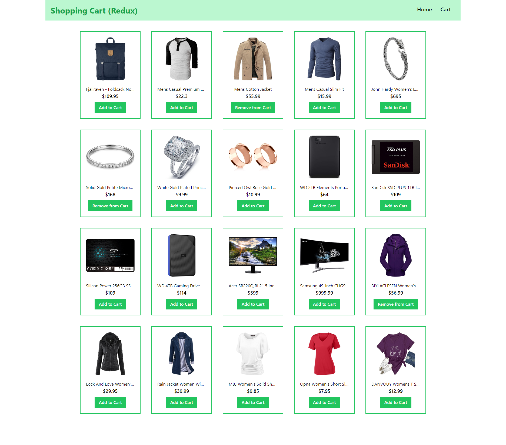
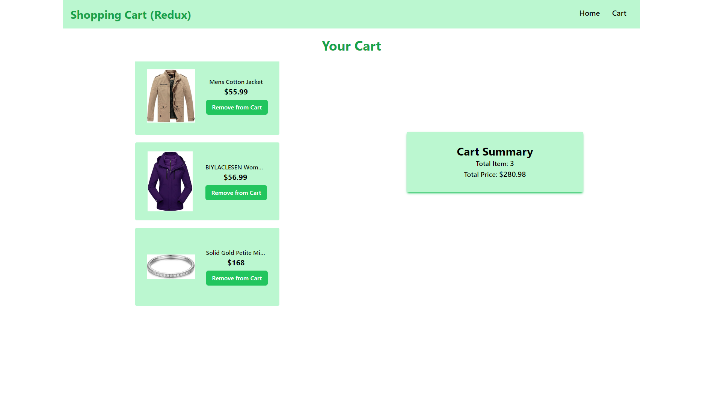

# Shopping Cart (Redux) - [Visit Now](https://rtk-shopping-cart.netlify.app/)

This project is a React application that utilizes Redux for state management and Tailwind CSS for styling. It fetches product data from the FakeStore API and provides features for managing a shopping cart.

## Features

- Displays products from the FakeStore API on the home page.
- Allows users to add and remove products from the cart.
- Provides a cart page where all cart products are displayed.
- Enables users to remove items from the cart and view the cart summary.
- Shows a message when the cart is empty and provides a "Shop now" button for redirection.

## Technologies Used

- React.js
- Redux
- Tailwind CSS

## Screens

### Home page



### Cart page



## Installation

1. Clone the repository:

   ```bash
   git clone https://github.com/Abhijitkr/Shopping-cart
   ```

2. Navigate to the project directory:

   ```bash
   cd Shopping-Cart
   ```

3. Install dependencies using npm:

   ```bash
   npm install
   ```

## Usage

1. Start the deployment server

   ```bash
   npm run dev
   ```

2. Open your browser and go to http://localhost:5173
